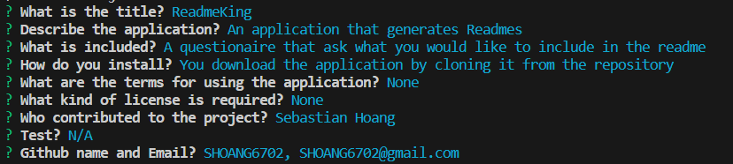

# ReadmeKing

The website serves as a way to allow users to generate professional READMEs to their liking. It simplifies the proccess of creating a README through a command line inquiry. 

## Installation

Download via github by cloning the repository

## Usage

A README generator that allows you to generate professional readmes.

Github Repository: 

https://github.com/SHoang6702/ReadmeKing

Youtube:

https://youtu.be/Vt8qTEejS3A

## Credits
Collaborators:
Sebastian Hoang
## Features

## License
None